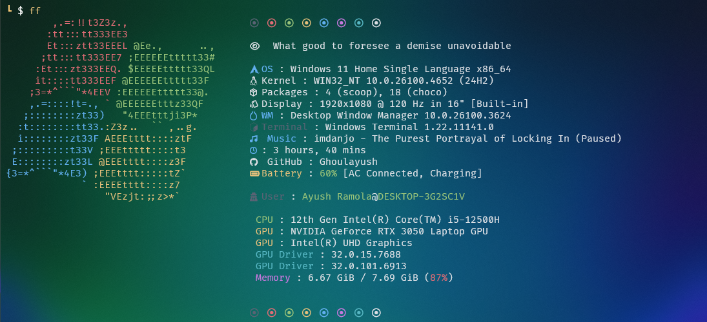

# Fastfetch Configuration

A custom fastfetch configuration that displays system information with a clean, aesthetic layout and custom colors.



## Overview

This configuration provides a personalized system information display with:

- Custom color palette showcase
- Philosophical quote header
- Comprehensive system information
- Custom OS age calculation
- Clean visual separators

## Features

### Display Elements

- **Color Palette**: Shows all terminal colors in a neat row
- **Quote**: "What good to foresee a demise unavoidable" - custom header text
- **System Info**:
  - Operating System
  - Kernel version
  - Package count
  - Display information
  - Window Manager
  - Terminal
  - Currently playing media
  - OS installation age (in days)
  - System uptime
  - GitHub profile placeholder
  - Battery status
  - User information
  - CPU details
  - GPU information and driver
  - Memory usage

### Color Scheme

- **Blue**: OS, WM, Uptime keys
- **White**: Kernel, Display keys
- **Green**: CPU, GitHub keys
- **Yellow**: GPU, Battery keys
- **Cyan**: GPU Driver, OS Age keys
- **Magenta**: Memory key
- **Black**: Terminal, User keys

## Installation

1. Ensure you have [fastfetch](https://github.com/fastfetch-cli/fastfetch) installed
2. Place the `config.jsonc` file in your fastfetch configuration directory:

   - **Linux**: `~/.config/fastfetch/`
   - **macOS**: `~/.config/fastfetch/`
   - **Windows**: `%APPDATA%\fastfetch\`

3. Run fastfetch:
   ```bash
   fastfetch --config config.jsonc
   ```

## Customization

### Adding Your GitHub Username

Edit line 59 in `config.jsonc`:

```jsonc
{
  "type": "custom",
  "format": "  󰊤  GitHub : your-username-here",
  "keyColor": "green"
}
```

### Modifying Colors

Each module has a `keyColor` property that can be changed to:

- `black`, `red`, `green`, `yellow`, `blue`, `magenta`, `cyan`, `white`
- `default` (uses terminal default)

### Changing the Quote

Modify the custom format on line 14:

```jsonc
{
  "type": "custom",
  "format": "     Your custom quote here  "
}
```

### Setting up an Alias

For convenience, you can create an alias `ff` to run fastfetch with this configuration:

**Linux/macOS (Bash/Zsh):**

```bash
# Add to ~/.bashrc or ~/.zshrc
alias ff='fastfetch --config ~/.config/fastfetch/config.jsonc'
```

**Windows (PowerShell):**

```powershell
# Add the old Windows ASCII art
# Make sure fastfetch path is set in Environment variable then

# Add this line in your PowerShell profile
function ff {
    fastfetch --logo windows
}
```

To set up the PowerShell profile:

1. Open PowerShell and create/edit your profile:
   ```powershell
   notepad $PROFILE
   ```
2. Add the function above to the file and save
3. Refresh your terminal session:
   ```powershell
   . $PROFILE
   ```

**Windows (Command Prompt):**

```cmd
# Create a batch file ff.bat in a directory in your PATH
@echo off
fastfetch --config "%APPDATA%\fastfetch\config.jsonc"
```

After setting up the alias, simply run `ff` to display your custom fastfetch configuration.

## OS Age Calculation

The configuration includes a custom command that calculates how long your OS has been installed:

```bash
birth_install=$(stat -c %W /); current=$(date +%s); time_progression=$((current - birth_install)); days_difference=$((time_progression / 86400)); echo $days_difference days
```

This works on Linux systems by checking the creation time of the root directory.

## Schema Validation

This configuration uses the official fastfetch JSON schema for validation and auto-completion in supported editors.

## Contributing

Feel free to fork and modify this configuration to suit your preferences. Share your improvements!
